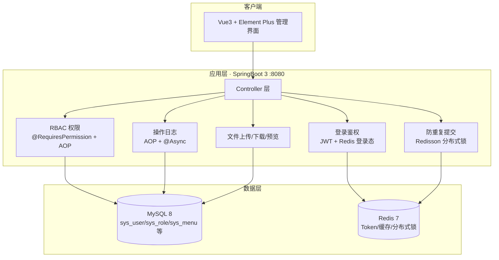
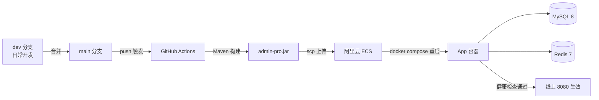

# admin-pro 后台管理系统（个人实战项目）

> GitHub 仓库：https://github.com/javaConsumables/admin-pro
> 在线演示：http://106.15.202.136:8080 （演示账号 zhangsan / XaCHDhCvg21tA1）
> 前端界面：http://106.15.202.136:8080/ （Vue 3 + Element Plus 管理后台，随应用一起部署）
> 技术栈：SpringBoot 3 + MyBatis-Plus + MySQL 8 + Redis + JWT + Redisson + Docker
> 开源协议：[MIT](LICENSE)

## 技术栈

JDK 17+ · SpringBoot 3.2.x · MyBatis-Plus 3.5.x · MySQL 8 · Redis 7 · JWT (jjwt 0.12) · Redisson 3.x · Docker

## 功能与里程碑（14 天计划全部完成）

- [x] Day 1-2 工程搭建：统一返回体、全局异常、MyBatis-Plus 分页、健康检查
- [x] Day 3-4 登录鉴权：JWT 签发/校验 + 拦截器 + 登录态存 Redis（登出/踢人）+ 用户管理
- [x] Day 5-6 RBAC 权限：用户-角色-权限三级模型、@RequiresPermission 注解 + AOP 校验、角色/菜单管理
- [x] Day 7-8 操作日志：@OperationLog 注解 + AOP 异步记录（密码脱敏、耗时、IP、成功/失败）
- [x] Day 9-10 文件上传 + Redis 缓存（Cache-Aside + 空值缓存防穿透）+ @NoRepeatSubmit 防重复提交（Redisson 分布式锁）
- [x] Day 11-12 Docker 部署：多阶段 Dockerfile + docker-compose（MySQL/Redis/App）
- [x] Day 13-14 演示与收尾：全流程验证

## 开发流程（分支规范）

```text
dev 分支开发 → 测试通过 → 合并到 main → main 用于部署
```

- 日常开发、提交、推送都在 `dev` 分支：
  ```bash
  git checkout dev
  git add -A && git commit -m "描述改动"
  git push            # 推到 origin/dev
  ```
- 功能稳定后合并到 main 再部署：
  ```bash
  git checkout main && git merge dev && git push
  ```
- **自动部署分支由 `deploy-branch.txt` 控制**：文件内容为 `main` 或 `dev`，修改并提交即可切换（无需改 workflow）。默认 `main`。

### 自动部署（GitHub Actions）

`main` 分支有提交时，流水线自动：构建 jar → 上传服务器 → 重启容器 → 健康检查（见 `.github/workflows/deploy.yml`）。

首次使用需在仓库配置 3 个 Actions secrets：

| Secret | 值 |
|---|---|
| SERVER_HOST | 106.15.202.136 |
| SERVER_USER | root |
| SERVER_PASSWORD | 服务器 root 密码 |

配置路径：仓库 Settings → Secrets and variables → Actions → New repository secret。

## 项目架构

### 系统架构



### CI/CD 部署架构



## 接口一览

| 方法 | 路径 | 说明 | 权限 |
|---|---|---|---|
| POST | /api/auth/login | 登录（返回 JWT + 用户信息） | 公开 |
| POST | /api/auth/logout | 登出（删除 Redis 登录态） | 登录 |
| GET | /api/auth/me | 当前登录用户 | 登录 |
| GET | /api/auth/permissions | 当前用户权限集合 | 登录 |
| GET | /api/users/page | 用户分页 | system:user:list |
| GET | /api/users/{id} | 用户详情（Redis 缓存） | system:user:list |
| POST | /api/users | 新建用户（防重复提交） | system:user:add |
| PUT | /api/users/{id}/status | 启用/禁用 | system:user:edit |
| PUT | /api/users/{id}/password | 重置密码 | system:user:edit |
| PUT | /api/users/{id}/roles | 分配角色 | system:role:edit |
| GET | /api/roles/page · /all | 角色分页/全部 | system:role:list |
| POST / PUT / DELETE | /api/roles | 角色增删改 | system:role:add/edit/delete |
| PUT | /api/roles/{id}/menus | 分配菜单权限 | system:role:edit |
| GET | /api/menus/tree | 菜单树 | system:menu:list |
| POST / PUT / DELETE | /api/menus | 菜单增删改 | system:menu:add/edit/delete |
| GET | /api/logs/page | 操作日志分页 | system:log:list |
| POST | /api/files/upload | 文件上传 | system:file:upload |
| GET | /api/files/page | 文件列表 | system:file:list |
| GET | /api/files/download/{id} · /preview/{id} | 下载/预览 | system:file:list |

**鉴权**：`Authorization: Bearer <token>`；JWT 无状态 + Redis 登录态（单点，新登录顶旧 token）。
**权限**：admin 角色放行全部；其余按 用户-角色-权限 三级校验（@RequiresPermission + AOP）。
**种子账号**：`zhangsan / XaCHDhCvg21tA1`（普通用户，公开演示）；`admin` 为超管账号，密码不公开。

## 本地开发（Windows 无管理员）

1. 启动基础设施（任选其一）：
   - **原生进程**（本机已装好）：双击 `start-dev.bat`（MySQL + Redis + 应用一键启动）
   - Docker：`docker compose up -d`（本机 Docker 端口转发异常时不可用，详见下）
2. 访问：`http://localhost:8080/api/health`、`/api/auth/login`

> 本机环境备注：Docker Desktop 端口转发层损坏（TCP 可连但数据不转发），故本地使用原生 MySQL（mysqld 8.0.28 用户数据目录，见 `mysql8-data`）与原生 Redis 8.10.1（见 `redis-win`）；Docker 方式用于服务器/云部署。

## 服务器部署（Linux）

```bash
git clone <仓库地址> admin-pro && cd admin-pro
docker compose up -d --build
# 验证
curl http://服务器IP:8080/api/health
```

首次启动时 mysql 容器会自动执行 `db/init.sql` 建表并写入种子数据。应用配置通过环境变量注入（DB_URL/DB_USERNAME/DB_PASSWORD/REDIS_HOST/REDIS_PORT）。

> ⚠️ Docker 首次初始化 MySQL 时中文可能双重编码（昵称/菜单名乱码），修复：
> `cat db/fix-chinese-encoding.sql | docker exec -i admin-pro-mysql mysql -uroot -proot`
>
> 低带宽服务器（如国内 ECS 访问 Maven 很慢）可改用运行时部署：本机构建 jar 后
> `docker compose -f docker-compose.runtime.yml up -d --build`（配合 Dockerfile.runtime，跳过服务器端 Maven 构建）。

## 目录结构

```text
src/main/java/com/adminpro/
├── AdminProApplication.java
├── annotation/       # @RequiresPermission @OperationLog @NoRepeatSubmit
├── aspect/           # 权限校验 / 操作日志 / 防重复提交 三个 AOP 切面
├── common/           # 统一返回体、返回码、全局异常
├── component/        # 异步日志记录器
├── config/           # MyBatis-Plus 分页、Web 拦截器、线程池
├── controller/       # Auth/User/Role/Menu/Log/File
├── dto/ vo/          # 请求/响应模型
├── entity/ mapper/   # MyBatis-Plus 实体与 Mapper
├── interceptor/      # JWT 鉴权拦截器
├── service/          # 业务逻辑（登录、权限、用户缓存）
└── util/             # JWT、密码加盐哈希
src/main/resources/application.yml
db/init.sql           # 全量建表 + 种子数据（幂等）
Dockerfile / docker-compose.yml
```

## 关键技术点（面试可讲）

1. JWT：HS512 签名、无状态、Redis 登录态支持登出/踢人；
2. RBAC：用户-角色-权限多对多，注解 + AOP 校验，admin 角色特判放行；
3. 密码安全：随机盐 + SHA-256，接口日志密码字段自动脱敏；
4. 防重复提交：Redisson RLock（tryLock 0 等待 + 租约），key=用户+接口+参数哈希；
5. 缓存：Cache-Aside + 空值缓存防穿透（不存在也缓存 60s）；
6. 操作日志：AOP + @Async 线程池异步落库，失败不影响主流程。